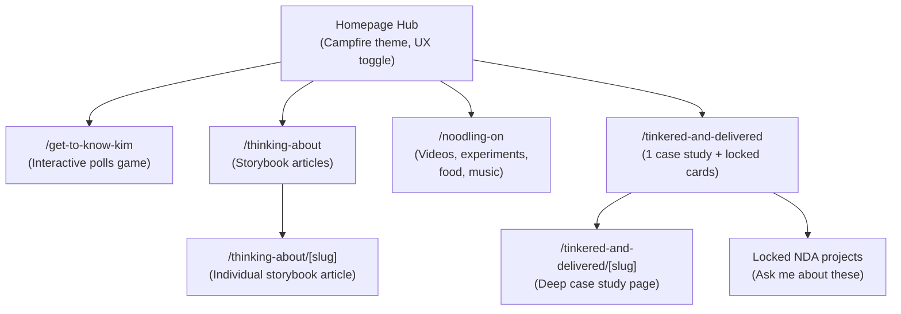
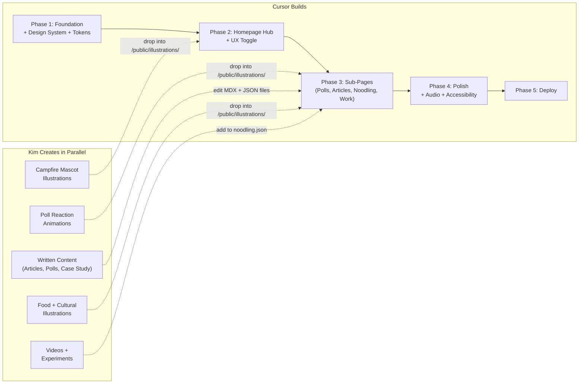

# Kim's World -- Portfolio Build Plan (v2)

## Design Principles

Six principles guiding every decision:

1. **Show, Don't Tell** -- The site's UX, system design, and interactions are the proof of skill. The Good/Bad UX toggle is the ultimate expression of this.
2. **Cosy Over Corporate** -- Campfire warmth. Soft colours, hand-drawn illustrations, friendly copy. This is your space, not a LinkedIn profile.
3. **Progressive Disclosure** -- The homepage is a calm hub. Depth lives behind each door. Reward curiosity, don't overwhelm.
4. **Cultural Authenticity** -- Peranakan heritage expressed through palette, patterns, and food/cultural content woven naturally into "What I'm Noodling On" -- not a forced section.
5. **Rhythm and Flow** -- Sections have cadence. The campfire metaphor sets the pace: lean in, lean back, share a story.
6. **Generative by Design** -- JSON tokens as the single source of truth. Any AI agent on any platform can read, understand, and modify the system.

---

## Guiding Principle: Illustrations Are Parallel Work

All illustrations and animations are created in Procreate on a separate track. The codebase uses a placeholder component (`<IllustrationSpot />`) everywhere art will appear. Each slot has a `name` prop (e.g. `"hero-campfire"`, `"poll-reaction-yes"`) and renders a soft gradient shimmer placeholder until the real asset is dropped into `/public/illustrations/`. No code changes needed to swap in final art.

---

## Information Architecture

The homepage is a **hub** -- clean, focused, one screen. Depth lives in sub-pages.




**Homepage sections (minimal scroll, almost single-screen):**

- Name, tagline, mascot by campfire illustration
- Good UX / Bad UX toggle (prominently placed)
- 4 navigation cards arranged around the warmth:
  - "Get to Know Kim"
  - "What I'm Thinking About"
  - "What I'm Noodling On"
  - "What I've Tinkered and Delivered"
- Small "currently listening" widget (optional, subtle)
- Warm footer with contact links and mascot wave

---

## The Campfire Visual Concept

The homepage evokes the qualities of a campfire without being literally a camping website:

- **Warm radial gradient** at the centre of the page -- brighter cream/gold fading to softer emerald/charcoal at the edges, like firelight
- **Peranakan palette as firelight**: golds and rose pinks are the warm glow, cream is the ambient light, jade and emerald are the calm surroundings
- **Mascot illustration** (Procreate) of Kim by a small campfire -- the one literal element
- **Subtle particle animation**: tiny golden sparks drifting upward (CSS or lightweight canvas, respects reduced motion)
- **Navigation cards** glow softly on hover, like objects catching firelight
- **Audio option**: ambient lo-fi with a hint of warmth when toggled on

The campfire is about **warmth, intimacy, and gathering to share stories**. Every sub-page is a story being told around the fire.

---

## The Good UX / Bad UX Toggle

The hero feature of the portfolio. A prominent toggle on the homepage that swaps the entire page between two experiences:

### Good UX Mode (default)

The campfire homepage as described. Clean, warm, focused, clear navigation, considered typography, accessible, delightful.

### Bad UX Mode

The same content presented as a genuinely bad website. This demonstrates UX expertise by visceral contrast. Specifics:

- **Cookie consent nightmare**: Full-screen banner with dozens of checkboxes, an "Accept All" button in bold green, and a "Reject All" link in 6px light-grey text at the bottom
- **Autoplay audio**: A midi-style track starts immediately. The mute button is an 8x8px icon in the far corner
- **Popup stack**: A newsletter signup modal appears after 1 second. Before you can close it, a "Rate this site!" popup appears on top. A chat widget bounces in the corner
- **Visual chaos**: Comic Sans and Papyrus fonts. Low-contrast grey-on-white body text. Clashing neon colours. Tiled background image
- **Navigation**: Unlabelled mystery-meat icon navigation. A horizontal scrolling ticker replacing the header. Dropdown menus that close if your mouse drifts 1px off
- **Content crimes**: "Click here" links with no context. Important info hidden behind "Read more" truncation. Marquee-scrolling job title
- **Nostalgia layer**: Visitor counter ("You are visitor #0000347"), "Best viewed in Internet Explorer 6.0 at 800x600", an "Under Construction" GIF, cursor trail with sparkles
- **Aggressive tracking vibes**: "We noticed you're about to leave!" exit-intent popup

The toggle between the two should be satisfying -- a smooth transition from chaos to calm (or calm to chaos). The contrast IS the portfolio piece. No explanation needed.

**Technical note**: Both modes render from the same data/components with a `useUXMode()` context provider that swaps style tokens and enables/disables the bad-UX overlays. This keeps the codebase clean.

---

## Phase 1 -- Foundation (Generative Design System)

**Goal**: A running Next.js app with a complete AI-friendly token system and core component primitives.

### 1a. Project scaffold

- `create-next-app` with App Router + Tailwind CSS v4
- Folder structure:

```
kims-world/
  app/
    page.tsx                    # Homepage hub
    get-to-know-kim/
      page.tsx                  # Polls game
    thinking-about/
      page.tsx                  # Article listing
      [slug]/page.tsx           # Individual storybook article
    noodling-on/
      page.tsx                  # FigJam-style canvas
    tinkered-and-delivered/
      page.tsx                  # Project listing (unlocked + locked)
      [slug]/page.tsx           # Individual case study
    layout.tsx                  # Root layout with providers
    globals.css                 # Generated from tokens (do not edit directly)
  components/
    ui/                         # Primitives (Button, Card, NavCard, etc.)
    features/                   # Feature components (PollGame, UXToggle, etc.)
    illustrations/              # IllustrationSpot wrapper component
  content/
    articles/                   # MDX storybook articles
    projects/                   # MDX case study files
    polls.json                  # Poll questions and Kim's answers
    noodling.json               # Noodling-on cards data
    projects.json               # Project manifest (locked/unlocked flags)
  tokens/
    tokens.json                 # W3C DTCG design tokens (SOURCE OF TRUTH)
    build.mjs                   # Style Dictionary build script
  lib/
    hooks/                      # useAudio, useUXMode, useScrollReveal
    utils/                      # Helpers
  public/
    illustrations/              # Drop zone for Procreate exports
    audio/                      # Ambient tracks
  .cursorrules                  # AI agent guidance file
```

### 1b. JSON design token system (W3C DTCG format)

The single source of truth is `tokens/tokens.json` in W3C Design Tokens Community Group format. Every token has a `$value`, `$type`, and `$description` so any AI agent (Cursor, Claude, Copilot, Figma Tokens Studio) can parse and understand intent.

```json
{
  "$name": "Kim's World Design Tokens",
  "color": {
    "jade":      { "$value": "#2A9D8F", "$type": "color", "$description": "Primary. Peranakan turquoise tiles. CTAs, links, active states." },
    "rosepink":  { "$value": "#E76F51", "$type": "color", "$description": "Accent. Nyonya textile coral-pink. Highlights, hover, emphasis." },
    "emerald":   { "$value": "#264653", "$type": "color", "$description": "Deep tonal. Dark backgrounds, headers, footer." },
    "gold":      { "$value": "#E9C46A", "$type": "color", "$description": "Warm highlight. Badges, callouts, campfire glow." },
    "cream":     { "$value": "#FFF8F0", "$type": "color", "$description": "Page background. Warm off-white." },
    "charcoal":  { "$value": "#2B2D42", "$type": "color", "$description": "Body text. Dark but not black." },
    "blush":     { "$value": "#FFDDD2", "$type": "color", "$description": "Subtle fill. Card backgrounds, soft sections." }
  },
  "semantic": {
    "primary":    { "$value": "{color.jade}",     "$type": "color", "$description": "Primary action colour" },
    "accent":     { "$value": "{color.rosepink}",  "$type": "color", "$description": "Secondary emphasis" },
    "background": { "$value": "{color.cream}",     "$type": "color", "$description": "Default page background" },
    "text":       { "$value": "{color.charcoal}",  "$type": "color", "$description": "Default body text" },
    "glow":       { "$value": "{color.gold}",      "$type": "color", "$description": "Campfire warmth, radial glow" }
  }
}
```

A `tokens/build.mjs` script (using Style Dictionary) transforms `tokens.json` into:

- `app/globals.css` -- CSS custom properties + Tailwind `@theme` block
- Optionally: a JSON export for Figma Tokens Studio sync

To restyle the entire site: edit `tokens.json`, run build, done. Or prompt any AI agent to edit the JSON directly.

### 1c. `.cursorrules` file

Documents for AI agents:

- Token system location and format (`tokens/tokens.json`)
- How to rebuild CSS after token changes (`npm run build:tokens`)
- Component naming conventions and folder locations
- Content file formats (MDX for articles/case studies, JSON for polls/noodling/projects)
- How to add a new poll, article, noodling card, or project
- The UX toggle system (`useUXMode` context)
- Illustration slot naming convention

### 1d. Core component primitives

- `Button` -- primary/secondary/ghost variants
- `Card` -- content container with soft shadow, warm background
- `NavCard` -- homepage navigation card with glow-on-hover, icon, title, description
- `IllustrationSpot` -- placeholder system for Procreate art (shimmer until real asset exists)
- `PollCard` -- two-option interactive card with flip/reveal animation
- `AudioToggle` -- play/pause for ambient audio, subtle placement
- `ArticleCard` -- preview card for storybook articles (title + teaser)
- `NoodlingCanvas` -- the FigJam-style pannable/zoomable canvas container with dot grid background
- `StickyNote` -- a sticky note on the canvas (colour, rotation, handwritten font)
- `CanvasCard` -- flexible card for the canvas (supports video, image, embed, link; positioned with x/y/rotation)
- `DrawingLayer` -- transparent canvas overlay for ephemeral freehand drawing
- `CanvasToolbar` -- floating toolbar with explore/draw mode toggle + zoom-to-fit button
- `ProjectCard` -- case study preview, supports "locked" state with lock icon
- `NavBar` -- minimal sticky nav with section links, UX toggle placement
- `Footer` -- contact links, mascot wave, warm sign-off
- `UXToggle` -- the Good/Bad UX switch component

---

## Phase 2 -- Homepage Hub + UX Toggle

**Goal**: The homepage and navigation system. The first thing anyone sees.

### 2a. Homepage hub (Good UX mode)

- Warm cream background with subtle radial gradient (gold centre fading to edges)
- `IllustrationSpot name="hero-campfire"` -- Kim mascot by a small campfire, centre of page
- Name + tagline above: *"Kim [Surname]. Principal Product Designer. Storyteller. Pineapple-on-pizza defender."*
- The Good/Bad UX toggle, prominently placed (top-right or near the tagline)
- 4 `NavCard` components arranged below the mascot:
  - "Get to Know Kim" -- subtitle: "A game of polls"
  - "What I'm Thinking About" -- subtitle: "Stories and ideas"
  - "What I'm Noodling On" -- subtitle: "Always making things"
  - "What I've Tinkered and Delivered" -- subtitle: "The work"
- Optional: small "currently listening to" widget in the corner
- Footer with contact links (LinkedIn, email) and `IllustrationSpot name="footer-wave"`
- Framer Motion entrance animations on load
- Minimal scroll -- ideally fits in one viewport on desktop, comfortable short scroll on mobile

### 2b. Bad UX mode

- `useUXMode()` React context provider wraps the app
- When toggled to "bad", the homepage transforms:
  - Cookie consent banner renders on top (full-screen, obnoxious)
  - Font swaps to Comic Sans / Papyrus via CSS variable override
  - Colour tokens swap to clashing neons via a `bad-ux` token set in `tokens.json`
  - Autoplay midi audio starts (with tiny mute button)
  - Newsletter popup appears after 1 second
  - Chat widget bounces in corner
  - Visitor counter, marquee text, cursor trail activate
  - Navigation becomes unlabelled icons
  - "Under Construction" GIF appears
  - Exit-intent popup triggers on mouse-leave
- All bad-UX elements are separate components mounted/unmounted by the context
- The toggle transition: smooth crossfade between modes. Satisfying to switch back to Good UX
- The bad-UX token set is a second entry in `tokens.json` with intentionally terrible values

### 2c. Navigation and page transitions

- Minimal sticky nav: logo/name on left, section links + UX toggle on right
- Framer Motion `AnimatePresence` for page transitions between sub-pages
- Mobile: bottom navigation bar or hamburger menu (test both)
- All pages share the root layout with nav and footer

---

## Phase 3 -- Sub-Pages (Where the Depth Lives)

**Goal**: Each of the four navigation paths built as its own page/experience.

### 3a. Get to Know Kim (polls game)

Route: `/get-to-know-kim`

- Full-page interactive experience
- Reads from `content/polls.json`
- Polls appear one at a time (step-through or scroll-triggered)
- Each `PollCard` shows a question with two tappable options
- On selection: card flips/reveals Kim's answer + a short quip + `IllustrationSpot` reaction
- Topics: food (pineapple pizza, laksa vs pho), design opinions (dark mode vs light), music, cultural hot takes
- Progress indicator showing how many polls completed
- End screen: a summary of how aligned the visitor is with Kim + warm CTA to keep exploring
- Data structure is a simple JSON array -- easy to add/remove polls by editing the file or prompting an agent

### 3b. What I'm Thinking About (storybook articles)

Route: `/thinking-about` (listing) + `/thinking-about/[slug]` (individual article)

**Listing page:**

- A clean list of article links (inspired by Wattenberger's "I'm thinking about" section)
- Each entry: title + optional one-line teaser
- Simple, typographic, no visual clutter

**Individual article pages:**

- MDX files in `content/articles/` with frontmatter (title, date, teaser, tags)
- Rich, interactive storybook-style layouts using custom MDX components
- `IllustrationSpot` slots for diagrams and sketches
- Topics: "Why design systems fail at scale", "AI-native product design", "The case for boring UX", "How I think about business outcomes"
- These function as **thought leadership that demonstrates principal-level thinking** without needing to show client work
- Easy to add new articles: create an MDX file, it appears in the listing automatically

### 3c. What I'm Noodling On (FigJam-style canvas)

Route: `/noodling-on`

A pannable, zoomable canvas that looks and feels like a FigJam board -- the tool designers actually noodle in. Visitors explore spatially rather than scrolling. Content is scattered in freeform layout across an infinite canvas.

**Canvas foundation:**

- Dot grid background (warm cream with subtle dots, like FigJam)
- Pan via click-and-drag (hand cursor in explore mode)
- Zoom via scroll wheel / pinch-to-zoom on touch
- Lightweight custom implementation: a `<div>` with CSS `transform: translate(x, y) scale(z)` driven by mouse/touch events + Framer Motion for smooth inertia
- No heavy library needed -- content is read-only (visitors explore, they don't rearrange)
- "Zoom to fit" button to reset the view if someone gets lost

**Content items on the canvas:**

- **Sticky notes** in Peranakan palette colours (jade, rose pink, gold, blush) with a handwritten-style font -- short thoughts, hot takes, ideas
- **Image cards** pinned at slight angles -- Procreate illustrations, food drawings, screenshots
- **Video thumbnails** with a play button -- talks, experiments (click opens modal or link)
- **Link cards** -- external references, articles
- **Embed cards** -- Spotify playlists, other widgets
- **Section labels** in a marker-pen font -- loose zones like "food things", "design thoughts", "music", "experiments" (not rigid, just orienting)
- Optional: **connector lines** between related items for authenticity

Items are freeform-positioned -- slightly rotated, occasionally overlapping, like someone's been moving things around. It feels lived-in.

**Data structure** in `content/noodling.json`:

```json
[
  {
    "id": "laksa-illustration",
    "type": "sticky",
    "content": "Drawing laksa from memory. Got the noodles wrong three times.",
    "color": "rosepink",
    "x": 120, "y": 340, "rotation": -3,
    "tags": ["food", "procreate"]
  },
  {
    "id": "design-system-talk",
    "type": "video",
    "title": "Why your design system needs a therapist",
    "thumbnail": "noodling-ds-talk",
    "link": "https://youtube.com/...",
    "x": 480, "y": 200, "rotation": 1.5, "width": 280,
    "tags": ["design-systems", "talk"]
  },
  {
    "id": "boring-ux-thought",
    "type": "sticky",
    "content": "Hot take: the best UX is boring UX.",
    "color": "gold",
    "x": 800, "y": 420, "rotation": 2,
    "tags": ["design"]
  },
  {
    "id": "spotify-playlist",
    "type": "embed",
    "title": "Current coding playlist",
    "embedUrl": "https://open.spotify.com/embed/...",
    "x": 300, "y": 600, "rotation": -1,
    "tags": ["music"]
  }
]
```

To add a new item: pick x/y coordinates, add the JSON entry. The board grows naturally over time.

**Ephemeral pencil drawing:**

- Two cursor modes toggled by a small floating toolbar (like FigJam's):
  - **Explore mode** (default): hand cursor, pan/zoom, click items to open
  - **Draw mode**: pencil cursor (a cute Procreate-style pencil icon from your illustrations), click-drag to draw freehand strokes
- Drawing is rendered on a transparent `<canvas>` layer overlaid on the board
- Strokes are smoothed (basic curve interpolation) so even messy input looks decent
- Stroke colour: a random muted Peranakan palette colour per session
- Drawings are **ephemeral only** -- they exist in the visitor's browser session and disappear on page leave or refresh. No persistence, no database, no moderation needed
- Think of it like drawing on a steamed-up window -- fun in the moment, gone when you walk away

**Mobile behaviour:**

- Canvas remains pannable/zoomable via touch gestures (pinch-to-zoom, drag-to-pan)
- Drawing mode: finger draws instead of mouse
- "Zoom to fit" button prominently placed
- Initial zoom level shows a good overview of all content

**Why this works:**

- Authentic to how a designer actually works
- Immediately memorable -- no other portfolio has this
- Shows technical chops (canvas, pan/zoom, drawing)
- Infinitely expandable -- new content is a JSON entry with coordinates
- Cultural heritage, food, music, experiments all coexist naturally as sticky notes and cards
- The freeform layout IS the identity -- no forced categories

### 3d. What I've Tinkered and Delivered (work)

Route: `/tinkered-and-delivered` (listing) + `/tinkered-and-delivered/[slug]` (case study)

**Listing page:**

- One unlocked `ProjectCard` -- clickable, leads to the full case study
- Several locked `ProjectCard` components: title + one-liner + lock icon + "Let's chat about this one"
- Reads from `content/projects.json`:

```json
[
  { "slug": "project-name", "title": "...", "teaser": "...", "locked": false },
  { "slug": "nda-project-1", "title": "...", "teaser": "...", "locked": true },
  { "slug": "nda-project-2", "title": "...", "teaser": "...", "locked": true }
]
```

- To unlock a project later: set `locked: false`, add the MDX file. Done.

**Case study page:**

- MDX file with frontmatter (title, role, timeline, company, tags)
- Custom MDX components: `<Problem />`, `<Process />`, `<KeyDecision />`, `<Outcome />`, `<Reflection />`
- Scroll-triggered section reveals via Framer Motion
- `IllustrationSpot` slots throughout for concept sketches, flow diagrams
- Ends with: *"This is one of many. I'd love to walk you through the rest."* + contact CTA

---

## Phase 4 -- Polish, Audio, and Delight

**Goal**: Micro-interactions, the audio layer, and the finishing touches that make it feel crafted.

### 4a. Audio system (subtle, optional)

- `useAudio` hook: manages ambient playback state
- A warm ambient track in `/public/audio/` (lo-fi or similar, something you have rights to)
- Audio is opt-in only. Toggle is subtle, not prominent
- When playing: the homepage radial gradient subtly pulses, golden sparks drift slightly more. Very understated.
- "Currently listening to" widget on the homepage (Spotify embed or static text + link)

### 4b. Micro-interactions and Framer Motion polish

- NavCard hover: soft glow intensifies, slight lift
- Page transitions: smooth crossfade between sub-pages
- Poll card: satisfying flip animation on answer reveal
- Scroll reveals on article pages and case study
- Illustration spots: gentle parallax or breathing animation
- Bad UX toggle: dramatic, satisfying transition between modes

### 4c. Accessibility pass

- `prefers-reduced-motion` media query: disables all animations, particles, parallax
- Semantic HTML throughout (proper headings, landmarks, lists)
- ARIA labels on interactive elements (toggle, polls, navigation)
- Keyboard navigation: all interactive elements reachable via Tab, Enter, Escape
- Colour contrast: validate all text/background combinations against WCAG AA
- Focus indicators: visible, styled to match the design (not default blue outline)

---

## Phase 5 -- Content, Performance, and Launch

### 5a. Content (Kim writes, Cursor helps refine)

- Finalise poll questions and answers in `polls.json`
- Write 2-3 storybook articles in MDX (Cursor can help draft from bullet points)
- Write the case study in MDX
- Populate `noodling.json` with initial content cards
- Drop completed Procreate illustrations into `/public/illustrations/`

### 5b. Performance

- Next.js Image component for all illustrations (auto-optimisation)
- Lazy-load audio system (Tone.js only loads on play click)
- Code-split Bad UX components (only load when toggled)
- Target Lighthouse 90+ on mobile
- Total page weight under 500KB on first load (excluding audio)

### 5c. Deploy

- GitHub repository
- Vercel project linked to repo (auto-deploy on push)
- Preview URLs for every branch/PR
- Custom domain setup (if you have one)
- OG image: a warm, branded card for social sharing (auto-generated or hand-designed)
- Meta tags for SEO: title, description, social cards

---

## Procreate Illustration Checklist (Your Parallel Track)

Create at your own pace. The site works with shimmer placeholders until each one is ready.

**Priority 1 -- Homepage (first impression)**

- `hero-campfire` -- Kim mascot sitting by a small campfire, welcoming pose
- `footer-wave` -- Mascot waving goodbye

**Priority 2 -- Polls game reactions**

- `poll-reaction-yes` -- Mascot celebrating / thumbs up
- `poll-reaction-no` -- Mascot shaking head / cringing playfully
- Custom per-poll illustrations (e.g. `poll-pineapple`, `poll-laksa`)

**Priority 3 -- Noodling On canvas**

- `pencil-cursor` -- a cute Procreate-style pencil icon used as the draw-mode cursor
- Food illustrations as sticky note attachments (nasi lemak, char kway teow, laksa, etc.)
- Any Procreate animations or experiments to showcase as canvas cards
- Thumbnails for video/link cards

**Priority 4 -- Articles and case study**

- Spot illustrations for storybook articles
- Concept sketches or simplified diagrams for the case study

**Priority 5 -- Easter eggs and details**

- Bad UX mode "Under Construction" GIF (maybe hand-drawn in your style?)
- Any hidden illustrations for curious explorers

**Recommended export format**: Animated GIF or APNG for simple loops. For interactive animations (hover/click triggers), export layers as PNG for later Lottie conversion.

---

## What Gets Built vs. What You Create




